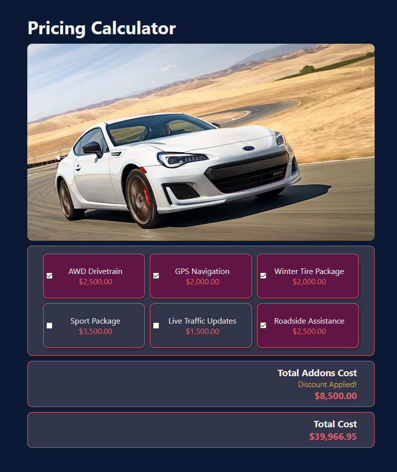

## About

A car pricing calculator made using React for calculating add-ons, applicable fees, and sur tax dynamically

## To run the app

- `npm install` and `npm start`
- Open [http://localhost:3000](http://localhost:3000) to view it in the browser.
